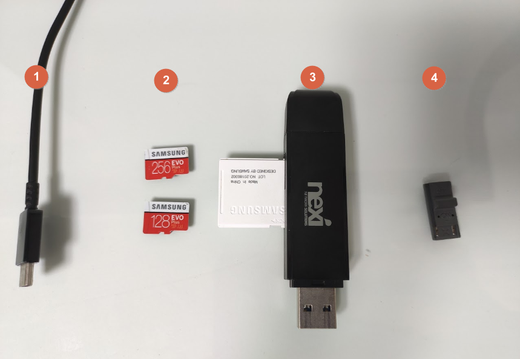

😎 먼저 `커스텀 펌웨어`를 설치하기 위해서는 몇가지 `준비물`들이 필요합니다.

스위치를 `SD카드 리더기` 대용으로 사용할 수도 있지만 최초 설치시에는 `SD카드 리더기`가 있는편이 작업이 편합니다.

 

<table style="border-collapse: collapse; width: 100%; height: 100px;" border="1" data-ke-style="style15" data-ke-align="alignLeft">
<tbody>
<tr style="height: 20px;">
<td style="width: 50%; height: 20px;"><b>준비물</b></td>
<td style="width: 50%; height: 20px;"><b>용도</b></td>
</tr>
<tr style="height: 20px;">
<td style="width: 50%; height: 20px;"><b>1. USB A to C 타입 케이블</b></td>
<td style="width: 50%; height: 20px;">데이터 통신이 가능해야합니다.</td>
</tr>
<tr style="height: 20px;">
<td style="width: 50%; height: 20px;"><b>2. SD 카드</b></td>
<td style="width: 50%; height: 20px;"><b>반드시 파일 시스템이 FAT32 방식이어야합니다.</b></td>
</tr>
<tr style="height: 20px;">
<td style="width: 50%; height: 20px;"><b>3. SD 카드 리더기</b></td>
<td style="width: 50%; height: 20px;">일반적인 USB 타입의 리더기면 OK</td>
</tr>
<tr style="height: 20px;">
<td style="width: 50%; height: 20px;"><b>4. RCM JIG(지그)</b></td>
<td style="width: 50%; height: 20px;">스위치 복구모드인 RCM모드로 진입을 돕습니다.</td>
</tr>
<tr>
<td style="width: 50%;"><b>5. RCM 로더기(편의사항으로 반드시 필요하진 않음)</b></td>
<td style="width: 50%;">RCM 모드 진입과 함께 페이로드 주입까지 가능합니다.</td>
</tr>
</tbody>
</table>

위 항목 중 `4.RCM 지그`같은 경우 클립을 구부려서 자작으로 `대체`가 `가능`하지만 그 과정이 매우 불편(?!) 하며, `성공률`도 낮은데다가 심지어 조이콘 레일에 `심각한 손상`을 줄 수도 있으니 저렴한 제품을 반드시 하나 정돈 `구매`하기 바랍니다.

`SD카드`의 경우 에뮤낸드의 원활한 구동을 보장받기 위해 반드시 최소 `삼성 evo 이상`급.

또는 `클래스 U3급`의 `메이저 제조사`의 고성능 제품을 사용하실것을 권장합니다.

쿠X,알X 등에서 판매하는 중국발 삼성 SD의 가품이나 렉사 등의 저가형 제품들이 이후 과정에서 `밴`방지를 위해 설치하게 될 `에뮤낸드`에서 실행불가와 같은 `호환성 문제`들이 종종 보고되고 있습니다.

따라서 왠만하면 국산 `삼성 정품`을 이용하시는 것을 추천합니다.
