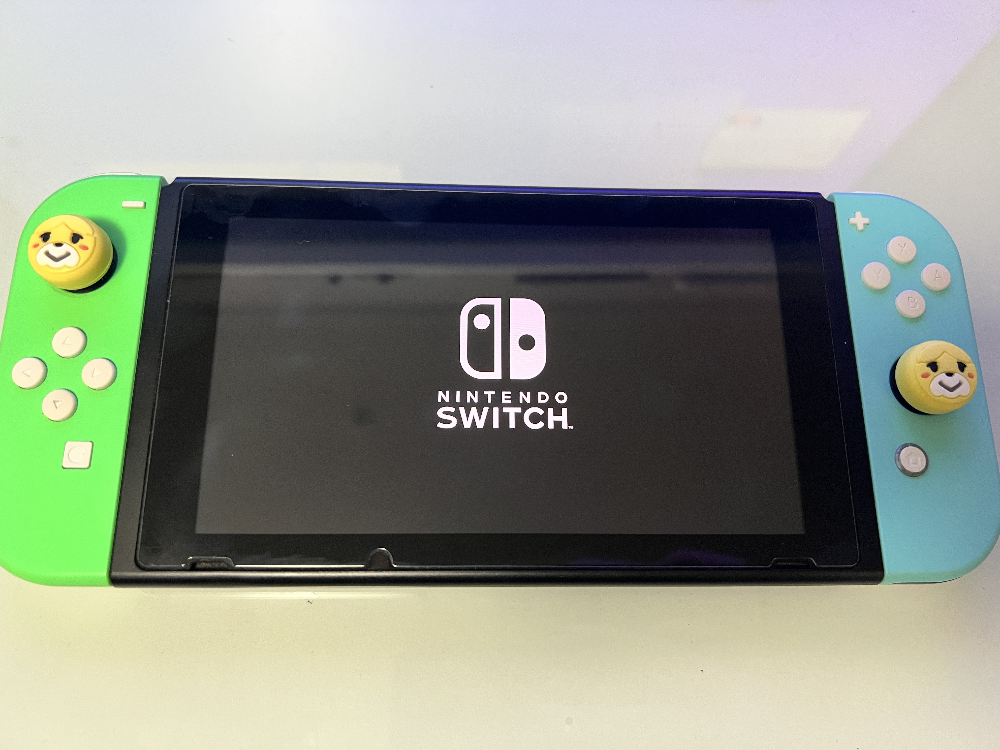
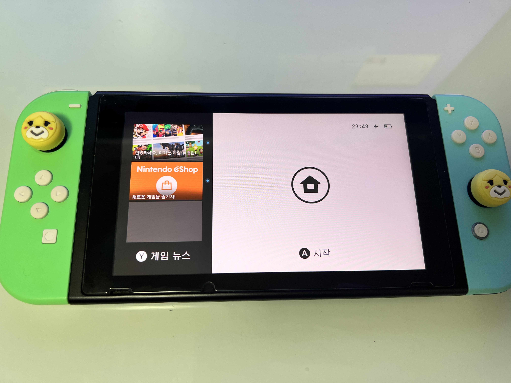
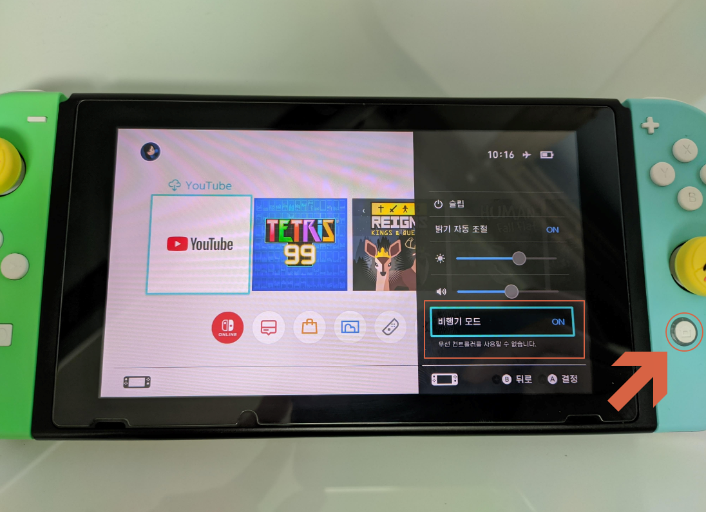
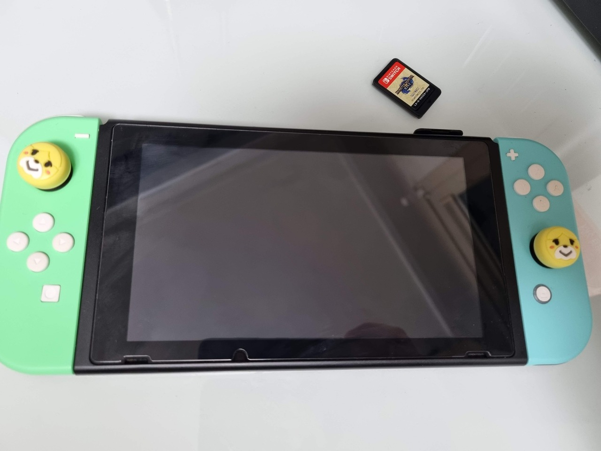
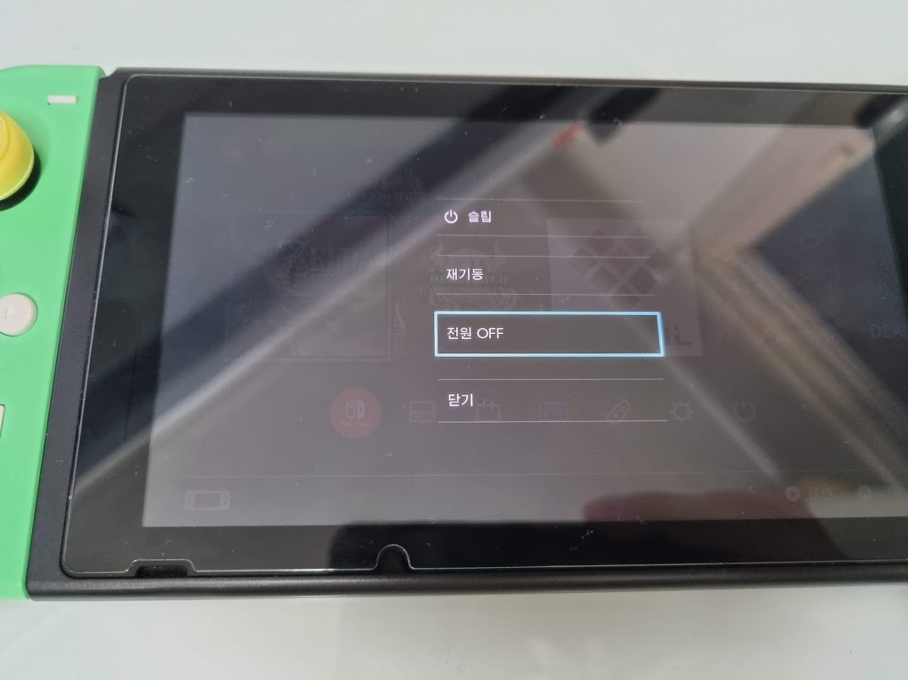
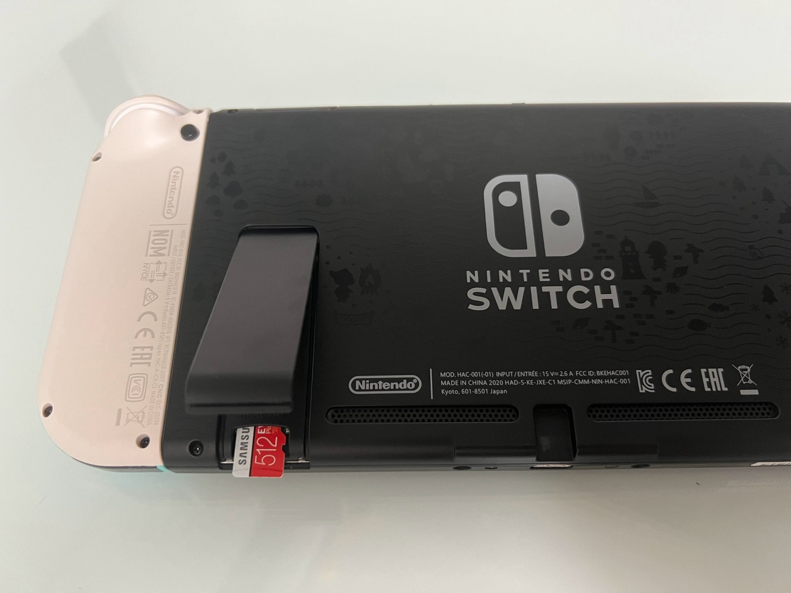

먼저 스위치가 정상적으로 정펌(정식 펌웨어)으로 부팅이 가능해야합니다.

전원을 켜고 `정펌`으로 부팅해줍니다.

 

정펌으로 부팅이 완료되면 스위치를 비행기모드 상태로 변경하도록 하겠습니다.

이는 혹시 모를 사고를 방지하기 위한 최소한의 조치이니 반드시 따라와주세요. 😭

 

### 2-1. 🛫 비행기 모드 진입

`커스텀 펌웨어` 설치 작업 전 스위치는 `정펌`으로 부팅한 상태에서, 우측의 홈버튼을 `1초이상 길게` 누르면 나타나는 `퀵 메뉴`에서 `비행기 모드`를 `ON` 으로 설정합니다.

이후 진행하게 될 과정에서 `아트모스피어`가 구동되고 `밴 방지 모듈`이 정상적으로 동작하지 못하는 경우가 발생하는 경우, `시스낸드 커펌` 환경에서 동작하게 되면 이숍 접속이나 업데이트등, 인터넷 연결시 기기에 이력이 남아 `밴`을 당할 위험이 있습니다.

따라서 `안전`을 위해 굳이 스위치를 정펌으로 부팅해서 `비행기 모드`로 진입해두고 시작하겠습니다.

이후 과정에서 다룰 `시스낸드`의 `복제본`인 `에뮤낸드`라는걸 만들기 전까진 일단 `비행기모드`를 유지합니다.

 

> 물론 `비행기 모드` 🛬 는 `권장사항`으로 반드시 진행해야 하는 것은 아니며, 만약 실수로 누락 되었다고 해서 부팅 후 즉시 `밴`을 당해버리거나 하진 않을테니 빠뜨렸다고 너무 큰 걱정은 마세요. 😊

 

### 2-2. 🚫 게임 카트리지 제거

커펌 과정 중에 기존에 커펌이 되어 있던 기기라면, 게임 카트리지가 장착된 경우 카트리지 내 저장된 버전 정보로 인해 오류가 일어나는 경우가 발생합니다.

이는 커스텀 펌웨어 설치를 진행하면서 배우게될 noGC 옵션을 통해 해결이 가능하지만, 아직은 정확한 원인을 알 수 없으실 상태이니 게임 카트리지를 본체에서 먼저 분리하고 진행하도록 하겠습니다.

 

### 2-3. 💾 SD 카드 분리

스위치의 커스텀 펌웨어는 모두 `SD 카드` 내 설치할 예정입니다.

따라서 `SD 카드`에 접근이 가능해야 하니 먼저 기기에서 `분리`해줄 필요가 있습니다.

`전원(슬립)` 버튼을 길게 눌러 전원을 완전히 `종료`해줍니다.

 

다음은 SD 카드를 미리 기기에서 분리해 놓도록 하겠습니다.
