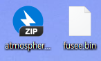
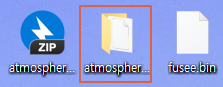

## 💾 최신버전 다운로드

[GitHub - Atmosphere-NX/Atmosphere](https://github.com/Atmosphere-NX/Atmosphere){:target="\_blank"}

위 링크의 공식 `아트모스피어(Atmosphere)` 깃허브로 이동해서 최신버전 파일을 다운로드 받아야합니다.

 

사이트 우측의 [Releases 링크](https://github.com/Atmosphere-NX/Atmosphere/releases){:target="\_blank"}를 눌러 릴리즈 페이지로 이동해줍니다.

 

최신 글 하단에 있는 `Assets` 버튼을 눌러보면 아래로 파일이 열리니 클릭해서 열어봅니다.

 

`Assets`을 열면 첨부된 파일들이 보이고 클릭해서 다운로드가 가능한데, `Source(소스)` 파일은 정말 개발자들이 사용하는 `원본 소스`이니 제외하고, 우리는 위 두개의 파일만 `다운로드` 받습니다.

✔ 다운로드 받은 파일들을 소개하자면 아래와 같습니다.

- `atmosphere-X.X.X` 등의 파일은 스위치 커스텀 펌웨어인 아트모 스피어 파일

- `fusee.bin`은 커스텀 펌웨어로 부팅하기 위한 `페이로드(Payload)` 파일

 

두 파일 모두 바탕화면등의 접근이 편리한 경로에 다운로드 받아줍니다.

 

## ⚡ 다운받은 파일 압축 풀기

다운로드 받은 `atmosphere-X.X.X`` 파일은 `zip`파일이니 압축을 풀어줘야 합니다.

압축툴은 일반적인 [반디집 ](https://kr.bandisoft.com/bandizip/){:target="\_blank"}이나 [7zip](https://www.7-zip.org/){:target="\_blank"} 이면 충분합니다.

파일의 압축을 풀면 위와 같이 `atmosphere`, `switch`, `hbmenu.nro` 라는 파일이 들어 있군요. 

각 폴더와 파일의 역할에 대해 알아볼까요?

- `atmosphere` 폴더는 말그대로 `커스텀 펌웨어` 구동을 위한 파일들입니다.

- `switch` 폴더는 `홈브류`라는 프로그램들이 설치 될 폴더입니다.

- `hbmenu.nro` 는 아트모스피어에 설치되는 첫번째 `홈브류`로 통칭 `홈브류 메뉴`입니다.

[CFW 관련용어](/gitbook/pages/cfwterms/){:target="\_blank"} 섹션에서 이미 한번쯤 봤던 익숙한 친구들일겁니다.

 

## 🔥 SD카드에 아트모스피어 설치

`SD 카드 설치`에 필요한 파일은 모두 다운로드 받았으니, 직접 설치해보도록 하겠습니다.

`SD카드 리더기`에 `SD카드`를 설치해줍니다.

 

준비된 `SD카드 리더기`를 PC에 연결해줍니다.

 

`커스텀 펌웨어`를 처음 설치하는 사용자라면 위처럼 `Nintendo 폴더`만 존재하는 상태이거나,

만약 단 한번도 스위치에 연결하지 않은 SD카드라면 위 `Nintendo 폴더` 조차 없을겁니다.

하지만 위 폴더의 존재는 작업에 전혀 `중요`하지 않습니다.

 

만약 위와 같은 `경고창`이 나타난다면 `절대` **디스크 포맷** 을 누르지 않습니다.

이경우 기존 SD카드에 윈도우가 인식 할 수 없는 RAW 타입의 `에뮤낸드`가 이미 생성되어 있는 경우입니다.

`클릭` 사고로 `데이터`를 날리지 않도록, 반드시 `취소` 버튼을 눌러 닫아줍니다.

 

미리 압축을 풀어두었던 `아트모스피어 폴더` 안에 `atmosphere` 폴더, `switch` 폴더, `hbmenu.nro` 등의 파일들을 SD카드에 모두 드래그 해서 복사해줍니다.

자! 이렇게 `아트모스피어`의 설치가 모두 `완료`되었습니다.

 

이런, 너무나 쉽다구요?

아직 `긴장`을 놓기엔 이릅니다.

수많은 `과정` 중에 1단계👍만을 완료한 셈이니까요. 👌

고생하셨습니다.

☕커피 한잔 하시고 다음 과정으로 넘어가도록 하겠습니다.

 

## 😎 만약 기존 커펌이 되어 있던 기기라면?

기존 커펌 사용자의 경우에는 정펌의 파일 폴더인 Nintendo와 에뮤낸드용 emuMMC 폴더를 **제외**하고 `사고방지`를 위해 전부 `백업`해야합니다.

과거 밴방지 방법이었던 Incognito 키 백업파일을 깜빡하고 지우는 일들이 있으니 작업이 완료 될때까지 반드시 남은 파일들을 백업해두어야 하며 5분이면 가능하니 반드시 귀찮아도 복사해둡니다.

 PC에 새폴더를 하나 만들어서 복사해주시면 되겠습니다.

 

백업폴더에는 emuMMC와 Nintendo 폴더를 제외한 모든 파일들이 이동(복사)되었습니다.

위처럼 복사된다면 커펌 업데이트 작업이 모두 완료되고 이상이 없다고 판단될 때까지 삭제하지 마시고 잠시 보관해주세요.

 

이번엔 SD카드에 emummc, Nintendo 폴더를 제외한 모든 파일을 SD카드에서 삭제해줍니다.

어떤 경우라도 emummc 폴더가 존재하는 경우 에뮤낸드의 설정 정보를 담고 있기 때문에 절대 삭제하지 않습니다.

(기존 시스낸드 커펌 사용자는 위 폴더가 없을테니 폴더가 없다면 무시하셔도 좋습니다.)

Nintendo 폴더의 경우 정펌에서 사용하는 폴더로 삭제하더라도 이숍에서 쉽게 재설치가 가능하지만,

다시 다운로드 받는 불편을 방지하기 위해 편의상 남겨두도록 하겠습니다.

 

결과적으로 SD카드에 위 두 폴더만 남았다면 준비가 완료된 셈입니다.

기존에 무엇이든 다른 커스텀 펌웨어가 설치되어 있던 경우라 해도 아트모스피어를 설치하기 위해 추가적인 복잡한 작업이 필요하진 않습니다.

위 파일 정리가 모두 끝났다면 이제 실제로 SD카드에 커스텀 펌웨어 파일들을 복사 해보겠습니다.
