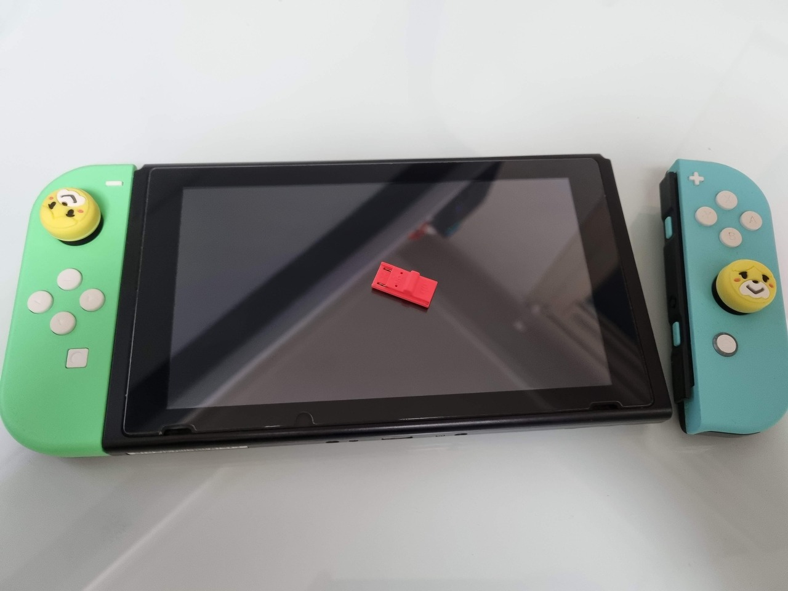
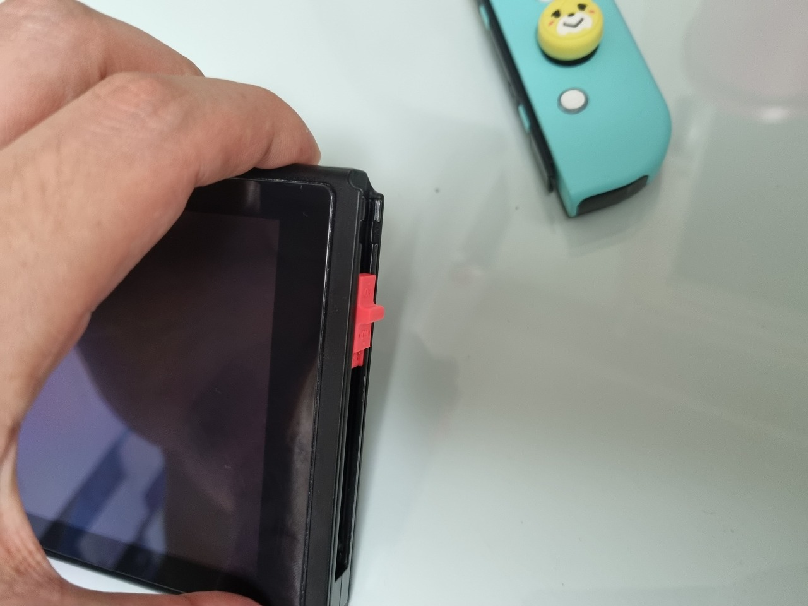
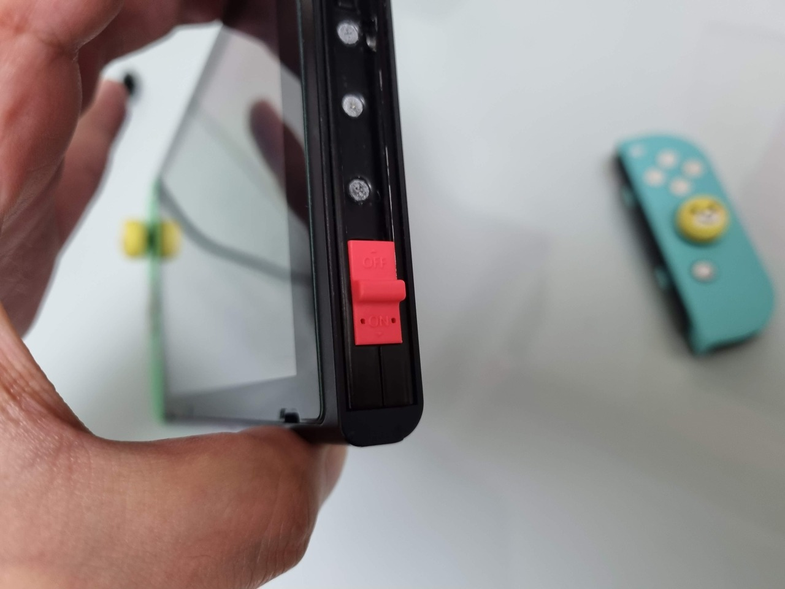
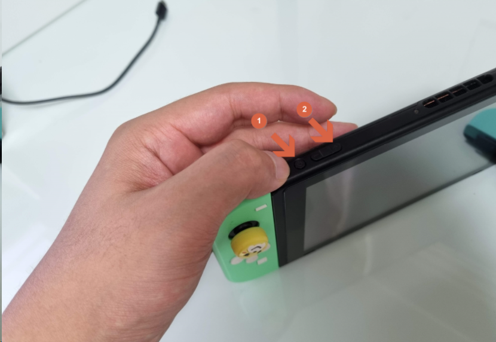
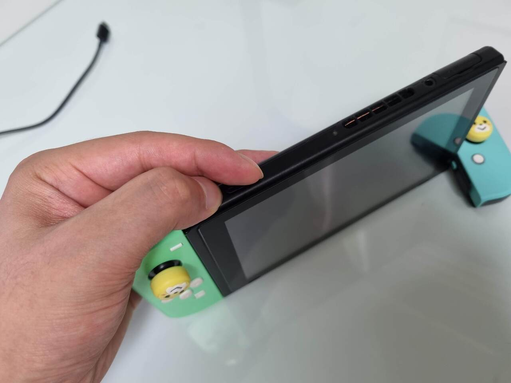
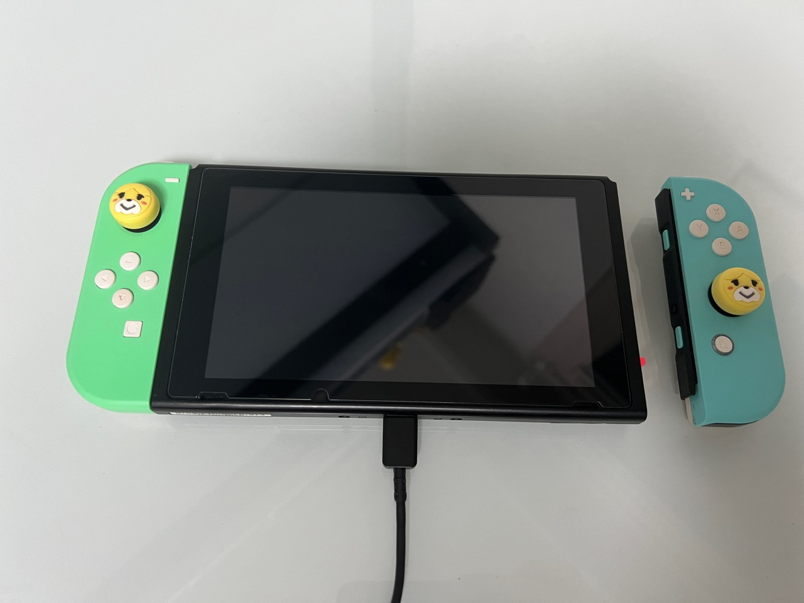

`RCM 모드`로 진입하기 위해 우측 `조이콘`을 분리하고 `RCM 지그(RCM JIG)`를 설치해보도록 하겠습니다.

`RCM 지그`의 설치는 전혀 어렵지 않지만 간혹 `불량` 처럼 접촉이 잘 안되는 제품들이 있으니 작동하지 않는다고 너무 당황하지 마시길 바랍니다.

이경우는 지그에 달린 핀을 이쑤시개 등으로 살짝 `위로 들어주면 수리`됩니다.

 

## 🧰 RCM JIG (RCM 지그) 설치하기

우측의 `조이콘 레일`을 따라 쭈욱~ 지그를 살살 밀어줍니다.

스위치 조이콘을 장착하는 방식과 완전히 `동일`합니다.

 

끝까지 밀어넣어 주시면 되는데 이때 너무 꽉 끼도록 누르지 않으셔도 됩니다.

작은 핀 두개로 우측 조이콘 레일 단자에 `접촉`해서 `쇼트`만 내주는 역할이기 때문에 너무 꽉꽉 넣으면 반대로 느슨해지는 수가 있습니다.

 

`RCM 모드`로 진입하기 위해서는`볼륨 +`를 누른채로 전원버튼을 `1초` 정도 눌러주면 쉽게 진입이 가능합니다.

일반적인 스마트폰의 `복구모드` 진입과 `유사`하다고 이해하시면 편합니다.

 

먼저 `볼륨 +` 버튼을 꾹 누르고 계신 채로 전원버튼을 살짝 `1초` 정도 눌러줍니다.

무언가 소리가 난다거나 특별한 변화가 생기진 않기 때문에 `RCM 모드`에 들어간 것인지 만건지 어리둥절 하실 수 있습니다.

 

사실 이렇게 기기는 겉으로 보기에는 전혀 변화가 없습니다.

마치 꺼져있는것처럼 보이는데, 실제로는 화면만 안들어 왔을뿐 이미 `복구모드`에 들어가 있는 상황입니다.

 

제대로 `RCM 모드`로 부팅이 되었는지 `PC`와 `USB C 타입 케이블`을 연결해보는 것으로 정확하게 `확인`이 가능합니다.

케이블을 연결하자 마자 PC에서는 장치가 연결되는 연결음이 `딩동댕~` 📢 하고 들리게 됩니다.

 

위 `RCM 모드` 상에서 PC에 `TegraRcmGUI` 같은 유틸리티를 실행해보면 `RCM O.K` 라는 `RCM 모드` 진입 성공 메세지가 나타납니다.

`RCM 모드`에 진입하는 것에 성공했다면 `자신감`을 좀 더 가지셔도 좋습니다.👍

다음은 위 사진의 `TegraRcmGUI` 를 설치하고 실제로 `아트모스피어`의 `페이로드`파일을 주입하기 위한 과정을 진행하겠습니다.
