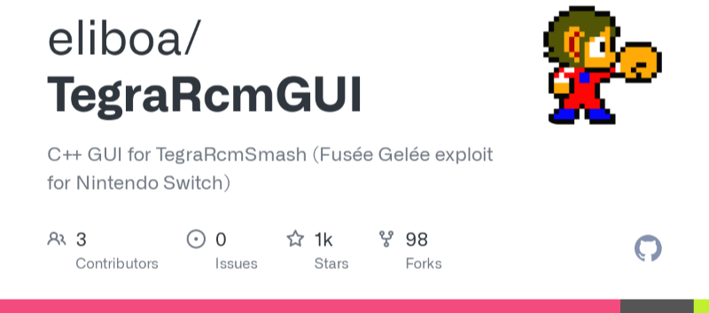

`RCM 모드`에 진입한 스위치에서 홈브류 구동 권한과 함께 스위치 공식 운영 체제 `Horizon OS`로 부팅하기 위해 전송하는  작은 `바이너리 파일(payload)` 입니다.

과거 1.0.0 펌웨어에서 4.1.0 까진 `Déjà Vu` 또는 `Caffeine`이 사용되기도 했지만 지금은 모두 `RIP(사망)` 되었으니, 일반적으로 [ReSwitched Team](https://twitter.com/reswitchedteam) 이 발견한 [Fusée gelée](https://github.com/Qyriad/fusee-launcher) 익스플로잇을 의미합니다.

쉽게 말해 `RCM 모드`에서 위 `payload(페이로드)`라는 파일로 부팅시 스위치 공식 운영 체제 `HOS`에서 허용하지 않은 서드파티 홈브류 들을 사용하는등, 마음대로 다룰 수 있게 만들어 줍니다.

 

### 🤜 TegraRcmGUI 다운로드

[Releases · eliboa/TegraRcmGUI · GitHub](https://github.com/eliboa/TegraRcmGUI/releases)

먼저 `TegraRCMGUI`라는 유틸리티를 `다운로드` 받아야합니다.

위 툴을 사용해서 `PC`에서 페이로드를 주입하는 방법으로 진행 하도록 하겠습니다.

`TegraRcmGUI` 개발자의 공식 깃허브인 위 사이트로 들어가줍니다.
