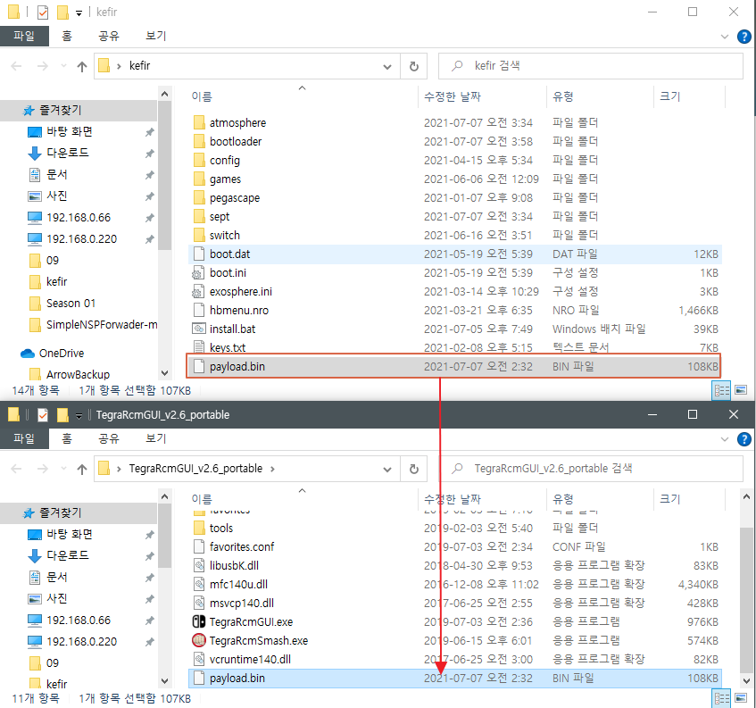

`Payload(페이로드)` 전송이란?

`RCM 모드`에 진입한 스위치에서 홈브류 구동 권한과 함께 스위치 공식 운영 체제 `Horizon OS`로 부팅하기 위해 전송하는  작은 `바이너리 파일(payload)` 을 전송하는 과정을 말합니다.

과거 1.0.0 펌웨어에서 4.1.0 까진 `Déjà Vu` 또는 `Caffeine`이 사용되기도 했지만 지금은 모두 `RIP(사실상 사망)` 되었으니, 일반적으로 [ReSwitched Team](https://twitter.com/reswitchedteam) 이 발견한 [Fusée gelée](https://github.com/Qyriad/fusee-launcher) 익스플로잇을 의미합니다.

쉽게 말해 `RCM 모드`에서 위 `payload(페이로드)`라는 파일로 부팅시 스위치 공식 운영 체제 `HOS`에서 허용하지 않은 서드파티 홈브류 들을 사용할 수 있게 환경을 만드는 과정이라 할 수 있습니다.

스위치의 `RCM 모드` 상에서 `테그라 X1 칩셋`의 `Fusée gelée 취약점`을 이용해 `페이로드` 파일을 전송해야만 스위치 `커스텀 펌웨어` 설치가 시작된다고 할 수 있습니다.

이를 위한 대표적인 유틸리티가 바로 아래 소개드릴 `TegraRcmGUI`입니다.

 

### 5-1. 🤜 TegraRcmGUI 설치

[Releases · eliboa/TegraRcmGUI · GitHub](https://github.com/eliboa/TegraRcmGUI/releases)

먼저 `TegraRCMGUI`라는 유틸리티를 `다운로드` 받아야 하겠죠?

위 툴을 사용해서 `PC`에서 페이로드를 주입하는 방법으로 진행 하도록 하겠습니다.

`TegraRcmGUI` 개발자의 공식 깃허브인 위 사이트로 들어가줍니다.

깃허브 사용법은 이미 아실것이라 믿습니다. 😙

`Release` 페이지에서는 항상 하단의 `Assets` 항목을 눌러 숨어있는 파일목록을 열어줍니다.

`TegraRCMGUI`의 경우 윈도우 환경의 `.msi` 인스톨러, 설치 버전도 존재 하지만 편의상 설치 조차 필요 없는 `Portable(포터블)` 버전을 다운로드 받도록 하겠습니다.

PC에서 `파일 명`을 클릭해서 `다운로드` 받아 주세요.

 

다운로드 받은 파일의 압축을 풀어주셔야합니다.

압축툴은 일반적인 [반디집](https://kr.bandisoft.com/bandizip/) {:target="_blank"}이나 [7zip](https://www.7-zip.org/){:target="_blank"} 이면 충분합니다.

 

[아트모스피어 설치](/gitbook/cfw/2022-02-02-Atmosphere.html){:target="_blank"} 과정에서 다운로드 받았던 fusee.bin 파일이 기억나시나요?

위 파일을 편의상 `TegraRcmGUI` 폴더 측으로 복사해 놓도록 하겠습니다.

🙌 위 파일은 `아트모스피어`의 `매 버전`마다 새롭게 바뀌기 때문에 `아트모스피어`로 부팅하기 위해선, 항상 최신 버전이 나올때마다 수동으로 파일을 `변경`해 주셔야합니다.

 

### 5-2. ⚙️ 드라이버 설치 및 파일 설정

본격적인 `페이로드` 파일 `전송(주입)`을 위해 `TegraRCMGUI`를 실행하도록 하겠습니다.

 

Windows OS 환경에서 스위치로 `페이로드` 파일을 전송하는 하는 방식이기 때문에 스위치와의 연결을 위한 `APX 드라이버`라는 것의 `설치`가 필요합니다.

1. 상단의 탭중에 `Settings`를 눌러줍니다.

2. `Install Driver`를 눌러줍니다.

 

`Install Driver`를 눌러주면 위 사진처럼 드라이버 설치창이 나타날겁니다.

첫번째 버튼인 `예(Y)`를 눌러주세요.

 

위 사진의 장치 드라이버 설치 마법사가 나타나면 `다음(N)` 버튼만 계속 `연타`해주시면 되겠습니다.

 

위 사진처럼 드라이버 설치 완료창이 나타나면 `마침` 버튼을 눌러주세요.

이제 `페이로드` 주입을 위한 사전 설치가 모두 `완료` 되었습니다. 👏

 

### 5-3. 🖥 USB를 이용한 스위치 연결

드라이버 설치가 완료되면 다음은 `PC`에 `USB C 타입 케이블`을 연결해주세요.

보통 일반적인 스마트폰 구매시 포함된 데이터 케이블 정도면 큰 문제없이 스위치 연결과 `페이로드` 주입에 사용이 가능합니다.

 

다음은 `TegraRCMGUI`에 페이로드 파일을 세팅하도록 하겠습니다.

1. `TegraRCMGUI`의 상단의 폴더 모양의 `열기` 버튼을 클릭해주세요.

2. 지난 과정에서 미리 폴더 안에 복사해주신 `fusee.bin` 파일을 선택해주세요.

3. 마지막으로 `열기(O)` 버튼을 눌러 주시면 `완료`입니다.

 

스위치에는 앞서 3장 [아트모스피어 설치](/gitbook/cfw/2022-02-02-Atmosphere.html){:target="_blank"} 과정에서 미리 만들어 두었던 `아트모스피어`가 사전 설치된 `SD 카드`를 넣어주도록 하겠습니다.

 

앞서 4장에서 다루었던 [RCM 모드 진입](/gitbook/cfw/2022-03-01-RCM.html) {:target="_blank"} 과정에서 배운 내용을 토대로 스위치를 `RCM 모드`로 진입해줍니다.

`RCM 모드`로 진입이 성공했다 싶으시면, PC와 스위치를 USB 케이블로 연결해줍니다.

 

성공적으로 RCM 모드에 진입하셨다면 위 사진처럼 `TegraRcmGUI` 화면 좌측 하단에 `RCM O.K` 라는 `RCM 모드` 진입 성공 메세지가 나타나게됩니다.
